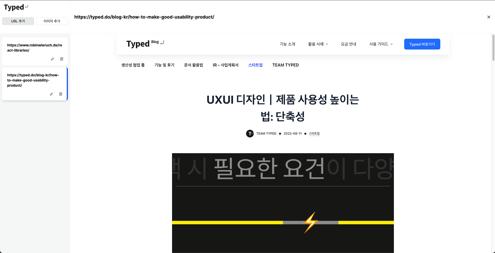

환영합니다! 이 README에서는 프로젝트를 실행하고 사용하는 방법을 안내합니다.




## Getting Started

### 사전 요구 사항

시작하기 전에 다음 항목이 설치되어 있는지 확인하십시오.
- Node.js
- npm or yarn

### Installation

1. 이 저장소를 로컬 컴퓨터에 복제합니다.
2. 터미널을 열고 프로젝트 폴더로 이동합니다.
3. 다음 명령어를 실행하여 프로젝트 종속성을 설치합니다:
```shell
npm install
```
또는

```shell
yarn install
```
4. 다음 명령어로 서버를 실행합니다

```shell
npm run dev
```

또는

```shell
yarn vite
```

## Feat

- typed-design-system 모듈을 사용하던 도중 emotion 버전 11이상을 사용했을 경우, 디자인시스템 이모션컨텍스트 임포트 구문에서 에러가 발생합니다. 정확한 테스트는 해보지 못했으며, 확인 필요해보입니다.
